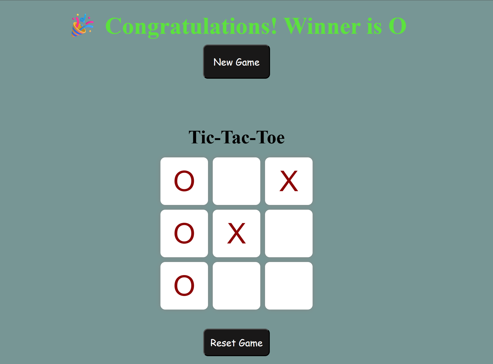

# 🎮 Tic-Tac-Toe Game

An interactive **Tic-Tac-Toe** game built using **HTML, CSS, and JavaScript**. Play with a friend in a classic two-player (X vs O) game with automatic winner detection and game reset functionality.

## 🌐 Live Demo

🔗 https://abhi003cs.github.io/tic-tac-toe/

## 📸 Screenshot



> **Note:** If your screenshot is in the repository's main folder, replace `images/screenshot.png` with `screenshot.png`.

## ✨ Features

* 🎯 Two-player gameplay (X and O)
* 🏆 Automatic winner detection
* 🤝 Detects draw matches
* 🔄 Reset Game button
* 🆕 New Game button
* 📱 Responsive and clean user interface

## 🛠️ Technologies Used

* HTML5
* CSS3
* JavaScript

## 🚀 How to Run

1. Clone this repository:

   ```bash
   git clone https://github.com/your-username/your-repository-name.git
   ```
2. Open the project folder.
3. Double-click **index.html** or open it in your preferred web browser.

## 📂 Project Structure

```text
Tic-Tac-Toe/
│── index.html
│── style.css
│── script.js
│── README.md
└── images/
    └── screenshot.png
```

## 👨‍💻 Author

**Abhishek Ranjan**
